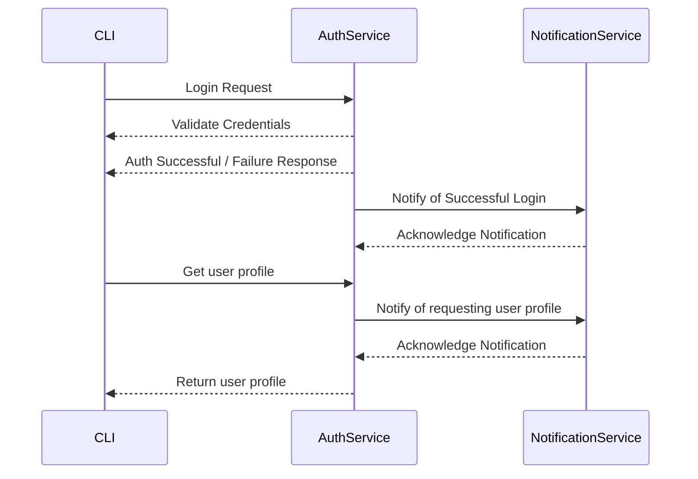

# TestingTask

## How to run the project

1. Clone the repository
2. Ensure you have docker installed on your machine
3. Run the following command to run the system
```bash
docker-compose up -d --build
docker-compose logs -f notification
```
4. Run the CLI with following command:
```bash
dotnet run --project CLI
```
5. Fill in the credentials as requested by the CLI with next data:
- Username: `andriana`
- Password: `123`

6. Observe the logs in the notification service and the CLI output.

## Architecture


